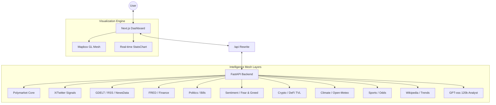

# UnivInsight

UnivInsight is a multi-dimensional intelligence dashboard that fuses prediction markets with 15 independent data layers. By bridging the gap between social signals, global news, and economic indicators, UnivInsight creates a unified "Intelligence Mesh" for analyzing market behavior.

---

## System Architecture

UnivInsight uses a decoupled Next.js/FastAPI architecture designed for real-time data aggregation and agentic reasoning.



---

## Intelligence Layers

UnivInsight aggregates data from 15 specialized modules to provide 360-degree context:

- **Market Intelligence**: Real-time order books and price history from Polymarket.
- **Social Intelligence**: Tracking social signals from X (Twitter) and connecting them to market outcomes.
- **News Intelligence**: A prioritized news waterfall (RSS -> GNews -> GDELT) with semantic filtering.
- **Economic Intelligence**: Financial indicators from FRED, AlphaVantage, and World Bank.
- **Political Intelligence**: Real-time tracking of US Congress bills and legislative activity.
- **Sentiment Analysis**: GDELT-based tone monitoring and the Crypto Fear & Greed index.
- **Crypto & DeFi**: Real-time pricing, market caps, and DeFi TVL metrics.
- **Environmental Context**: Global weather data and natural event tracking (EONET).
- **Sports & Odds**: Team logos, stadium data, and real-time betting odds.
- **Contextual Intelligence**: Google Trends and Wikipedia-derived knowledge graph context.

---

## Technology Stack

| Category | Technology |
| :--- | :--- |
| **Frontend** | Next.js 15, TypeScript, Tailwind CSS, Framer Motion |
| **Visualization** | Mapbox GL JS, Chart.js, React-Markdown |
| **Backend** | FastAPI, Httpx, Pydantic, Feedparser, Pytrends |
| **AI Engine** | Gemini 1.5 Pro (Classification), GPT-oss 120b (Agent) |

---

## Quick Start

### 1. Prerequisites
- **Python 3.10+** and **Node.js 18+**
- **Core Keys**: Mapbox, Gemini, X (Twitter), and DigitalOcean Agent Access.
- **Data Keys**: FRED, AlphaVantage, GNews, Currents, and The Odds API.

### 2. Launch Backend
```bash
cd backend
pip install -r requirements.txt
python main.py
```

### 3. Launch Frontend
```bash
cd frontend-next
npm install
npm run dev
```

---
Created by the UnivInsight Team.
